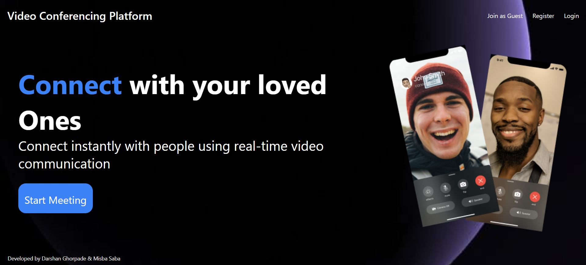

# Video Conferencing Platform

A real-time video calling web application built using WebRTC, React, Node.js, and MongoDB.

## Features
- Real-time video calling
- User authentication
- Meeting history
- Responsive UI

## Tech Stack
- Frontend: React.js
- Backend: Node.js, Express.js
- Database: MongoDB
- WebRTC for real-time communication

## Developed By
Darshan Ghorpade  
Misba Saba
## Screenshots



## How to Run Locally

Follow these steps to run the project locally:

```bash
# clone repo
git clone https://github.com/darshanghorpade222/Video-Conferencing-Platform.git

# enter project folder
cd Video-Conferencing-Platform

# run frontend
cd frontend
npm install
npm start

# run backend (open another terminal)
cd ..
cd backend
npm install
npm start
